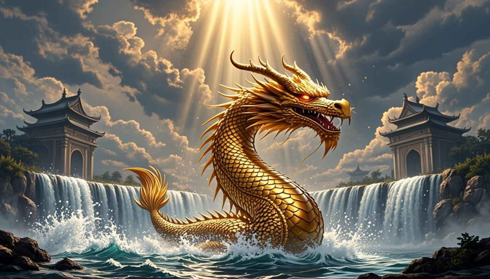

# 🐟 Koi Legend — Da Água à Ascensão do Dragão

A Web3 game based on the ancient legend of the Koi fish that transforms into a dragon after overcoming 12 trials. Built with Phaser 4 + Next.js 16 + TypeScript + Solidity.



## 📖 The Legend

> Há milênios, um peixe Koi decidiu nadar contra a correnteza de um rio impossível.
> Após 12 provações — pedras, predadores, tempestades e a própria cachoeira do dragão —
> ele se transformou em um ser celestial. Esta é a lenda. Este é o jogo.

## ✨ Features

### 🎮 Gameplay (Phaser 4)
- **2 playable phases** with real mechanics, physics, particles, and polish:
  - **Phase 1 — Rio Turbulento**: Side-scrolling survival swim with parallax, obstacles, collectibles
  - **Phase 11 — Cachoeira do Dragão**: Vertical ascent with transformation finale into a dragon
- Dynamic camera with adaptive zoom (zooms out at high speed for more reaction time)
- Speed lines feedback, drop shadows, atmospheric glow, particle effects
- 3-layer parallax backgrounds with god rays

### 🎨 Art
- 16 AI-generated assets: sprites (koi, rock, pearl, dragon), backgrounds (river layers, waterfall, hero), 7 NFT cards
- Custom chroma-key pipeline for sprite transparency

### 🃏 NFT Collection
- 12 phase cards (ERC-721) with rarity tiers and in-game abilities
- Card fusion/evolution system
- Marketplace UI

### 💎 Token Economy (Sustainable)
- **$KOI** — Governance token (ERC-20, fixed 100M supply)
- **$PEARL** — Utility/reward token (ERC-20, burn mechanism)
- Staking with real yield from marketplace fees (not Ponzi returns)
- Referral system (1 level, on fees not profits)

### ⚙️ Smart Contracts (Solidity)
- `KoiToken.sol` — Governance ERC-20 with phase access gating
- `PearlToken.sol` — Utility ERC-20 with daily mint cap + burn
- `KoiNFT.sol` — ERC-721 with fuse/evolution mechanics
- `KoiMarketplace.sol` — NFT marketplace with fee distribution

### 🎨 Landing Page
- Cinematic hero with god rays, floating dust motes, glassmorphism
- Interactive 12-phase journey map
- NFT gallery with rarity tiers
- Playable game demo embedded
- Tokenomics section with honest sustainability model
- Architecture/stack overview

## 🛠 Tech Stack

| Layer | Technology |
|-------|-----------|
| Game Engine | Phaser 4.2 (WebGL) |
| Frontend | Next.js 16, React 19, TypeScript 5 |
| Styling | Tailwind CSS 4, shadcn/ui, Framer Motion |
| Smart Contracts | Solidity 0.8.24, OpenZeppelin |
| Database | Prisma ORM (SQLite dev / Postgres prod) |
| Web3 (planned) | wagmi + viem + RainbowKit |
| Deploy | Vercel + IPFS + Ronin/Polygon |

## 🚀 Getting Started

```bash
# Install dependencies
bun install

# Run development server
bun run dev

# Open http://localhost:3000
```

### Generate Art Assets (optional)

```bash
# Generate all sprites/cards/backgrounds via AI
bun run scripts/generate-art.sh

# Process sprites (chroma key transparency)
bun run scripts/process-sprites.ts
```

### Smart Contract Deployment

Contracts are in `contracts/`. Deploy with Hardhat/Foundry to Ronin, Polygon, or Arbitrum.

```bash
# Example (requires Hardhat setup)
npx hardhat compile
npx hardhat run scripts/deploy.ts --network ronin
```

## 🎯 Game Design Principles

- **Scale**: Player occupies ~7% of screen width (proper side-scroller proportion)
- **Field of View**: Player at 22% from left, sees 78% ahead for reaction time
- **Dynamic Camera**: Zoom adapts to speed — closer when calm, wider when fast
- **Speed Perception**: Motion lines + FOV widening communicates velocity
- **Obstacle Legibility**: Bright outlines + drop shadows to pop from background

## 📂 Project Structure

```
├── contracts/              # Solidity smart contracts
│   ├── KoiToken.sol
│   ├── PearlToken.sol
│   ├── KoiNFT.sol
│   └── KoiMarketplace.sol
├── public/game/            # Game assets
│   ├── sprites/            # Koi, rock, pearl, dragon (transparent PNGs)
│   ├── scenes/             # Background art
│   └── cards/              # NFT card art
├── scripts/                # Art generation & processing
├── src/
│   ├── app/                # Next.js app router
│   ├── components/
│   │   ├── landing/        # Hero, JourneyMap, NFTGallery, GameSection, etc.
│   │   └── ui/             # shadcn/ui components
│   ├── game/               # Phaser game
│   │   ├── KoiGame.tsx     # React-Phaser bridge
│   │   └── scenes/         # Boot, River, Waterfall scenes
│   └── lib/                # Game data, utils
└── prisma/                 # Database schema
```

## ⚠️ Important Note on Tokenomics

This project deliberately does **NOT** implement "2.5%–5% daily mining returns" or multi-level referral schemes. Such models are mathematically unsustainable (8,700%–5.4 billion% annually) and structurally identical to Ponzi/HYIP schemes — illegal in most countries.

Instead, the economy is designed around:
- Real yield from marketplace fees (staking)
- Active burn mechanisms (20% of phase fees, 5% of marketplace sales)
- Single-level referrals on fee revenue (not on profits)
- Utility-driven token demand (phase access, card minting)

## 📜 License

MIT

## 🙏 Credits

- Legend: Ancient Chinese/Japanese folklore of the Koi and the Dragon Gate
- Game Engine: [Phaser](https://phaser.io)
- UI: [shadcn/ui](https://ui.shadcn.com)
- Art: AI-generated

---

> "A resiliência transforma peixes em dragões."
